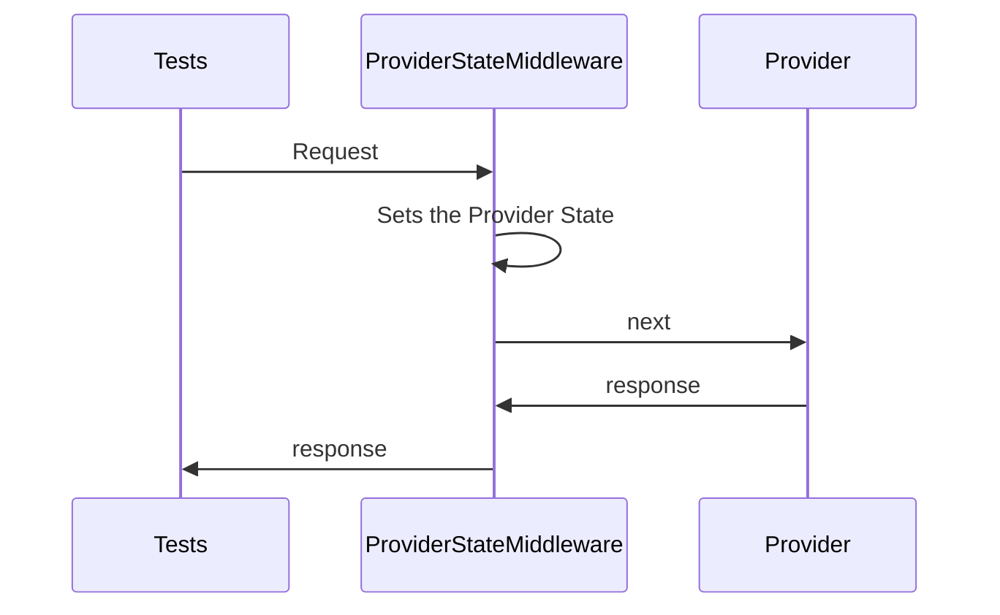

# Pact net, Dependency Injection et TestServer : Comment rendre le Contract Testing autonome (Partie 1)

## Pact .Net qu'est-ce que c'est ?
Si vous travaillez sur des systèmes distribués faisant intervenir plusieurs équipes distinctes vous avez très certainement rencontré un jour ou l’autre une situation similaire à celle qui suit.

> Votre équipe Alpha qui est un peu en avance décide de faire un peu de refactoring et de modifier une faute qui traîne depuis de mois sur l'une de ses propriétés et donc de renommer Childrens en Children, parce oui "C'est ridicule, children c'est déjà le pluriel de child alors ça ne sert a rien de mettre un S en plus !". Ils font les modifications adéquates, tous leurs tests sont au vert. Ils décident donc de mettre en production leur travail, fiers d'avoir enfin pu changer cette inacceptable faute pouvant endommager le serveur.
Pendant ce temps l'équipe Beta, elle, est plutôt à la traîne sur son sprint mais en donnant tout ce qu'il on pu donner, ses membres ont réussi à tenir l'objectif. Leurs US sont valides, tous leurs tests sont au vert, et confiants, ils valident également leur mise en production.
Quelques minutes plus tard des alertes arrivent chez l'équipe Beta signalant un problème bloquant sur une partie de leur applicatif... Sous pression et sans comprendre comment ni pourquoi cette partie de l'application que personne n'a touché depuis de mois se met à poser problème, ils mettent énormément de temps à comprendre qu'ils reçoivent curieusement des appels avec "Children" et non "Childrens"...

Il existe bien des manières de tester l'interaction entre les services et celle qui nous intéresse ici est le Consumer Driven Contract via le framework [Pact net]([https://github.com/pact-foundation/pact-net](https://github.com/pact-foundation/pact-net)), une implementation .Net de  [Pact.io]([https://docs.pact.io/](https://docs.pact.io/)).

Si vous voulez les détails de son fonctionnement je vous invite à lire l'un des nombreux articles expliquant comment mettre en place de manière conventionnelle Pact .Net. Mais comme je sais que vous ne le ferez certainement pas, je vous spoile un peu dans la partie suivante. 

## Et avec Pact, ça se serait passé comment ?
Si on reprend notre exemple précédent, comment se serait passé cette modification de "Childrens" ?
L'équipe Alpha, qui consomme un des services de l'équipe Beta émet des contrat générés par Pact indiquant comment ils appellent chaque service et comment ces services sont sensés leur répondre. Ils auraient donc généré et partagé avec l'équipe Beta un contrat spécifiant que leur nouvel appel au service utilise maintenant "Children" et non "Childrens".
Durant leur tests, l'équipe beta aurait validé chaque contrat qui leur correspond en effectuant sur leur service les requêtes contenues dans les contrat afin de vérifier la réponse renvoyée. Ils auraient alors directement pu voir qu'un de leur consommateur a changé la manière dont ils interagissent avec eux. Ils auraient alors pu éviter ce problème.

Vous pourrez me dire "Oui c'est sympa, mais pour vérifier le contrat il faut faire de vrais appel http, il faut que j'ai mon service accessible et que je mette des données spécifiques aux tests à l'intérieur... Puisque je fais des appels à mon propre service, il n'y a pas une approche me rendant un peu plus autonome ?!". Je suis content que cela vous pose problème, parce que la suite de cet article vous expliquera comment réaliser tout cela sans aucun appel Http réel tout en offrant la possibilité d'injecter les données à tester directement via le test. 

## Step 0 : Basic Pact .Net implementation
Nous partirons du principe que vous avez déjà mis en place une validation classique Consumer/Provider telle que décrite dans de nombres exemple sur [Pact net]([https://github.com/pact-foundation/pact-net](https://github.com/pact-foundation/pact-net)).
Pour vous faire gagner du temps, vous pouvez suivre les 3 étapes suivante :
1. Clonez ce repo sur cet [Initial commit](https://github.com/leonardocuco/PactNetCoreTestServerDI/commit/b66f0ed9e9ace28473650ac8ee9ff3a2bce8b309) 
 2. Ouvrez une invite de cmd sur le dossier "Povider/src/Provider.Api" et lancez la commande "dotnet run" pour lancer notre Provider service.
 4. Ouvrez la solution et lancez les tests "ProviderApi.Tests.Pacts"

Le projet de test devrai tester le contrat émis par le consumer (qui pour nos tests a déjà été généré par les test du Consumer et qui est situé à la racine dans "pacts\consumer-provider.json") en effectuant les appels à notre service lancé via notre commande "dotnet run".

Vous devriez voir les tests passer. Pour être sûr qu'on ne nous prenne pas pour des poires, allons dans le contrat "pacts\consumer-provider.json" et changeons la requête de notre consumer en remplaçant par exemple "vehiculId" par "Id" et relançons nos tests. On ne nous prends pas pour des poires, avec nos modifications la validation de notre contrat échoue bien.

Step 0 done. On attaque maintenant ce pourquoi vous lisez cet article.


## Step 1 : Stop aux appels Http !
### Comment Pacte effectue ses tests ?
La validation des contrat au niveau du Provider se fait via de vraies HttpRequests pointant vers le endpoint du service à tester. Sur cette implémentation basique cet endpoint est défini dans ProviderApiTests
 
 ```csharp
public ProviderApiTests(ITestOutputHelper output)
{
	_providerUri = "http://localhost:5000";
	...
}
```

Cet endpoint est utilisé lorsqu'on demande à Pact de vérifier le contrat. On lui spécifie alors le ServiceProvider et son Uri.
 ```csharp
 [Fact]
 public void EnsureProviderApiHonoursPactWithConsumer()
 {
     // Arrange
     PactVerifierConfig config = ConfigureCustomOutput();

     //Assert Pacts
     IPactVerifier pactVerifier = new PactVerifier(config);
     pactVerifier.ProviderState($"{_pactServiceUri}/provider-states")
         .ServiceProvider("Provider", _providerUri)
         .HonoursPactWith("Consumer")
         .PactUri(@"..\..\..\..\..\..\pacts\consumer-provider.json")
         .Verify();
 }
```

A partir de ce point, Pact va prendre chaque requête qu'il trouve dans le fichier de contrat, réaliser son appel sur le ServiceProvider et comparer la réponse reçue à celle spécifiée dans le contrat. Si tout est OK, le contrat est validé, sinon le test échoue.

### Et si on utilisait la classe TestServer à la place ?
Il y a peu de temps, Microsoft a introduit un ASP.NET Core web server permettant de réaliser des tests, Microsoft.AspNetCore.TestHost.

>ASP .NET Core includes a built-in test web host that can be used to handle HTTP requests without network overhead, meaning that you can run those tests faster when using a real web host. The test web host (TestServer) is available in a NuGet component as Microsoft.AspNetCore.TestHost. It can be added to integration test projects and used to host ASP .NET Core applications [...]([https://docs.microsoft.com/en-US/dotnet/standard/microservices-architecture/multi-container-microservice-net-applications/test-aspnet-core-services-web-apps](https://docs.microsoft.com/en-US/dotnet/standard/microservices-architecture/multi-container-microservice-net-applications/test-aspnet-core-services-web-apps))

Ok, ça parait simple, créons un TestServer et utilisons son adresse comme "_providerUri" pour la validation de notre Pact et le tour est joué !
Et bien pas vraiment, parce que le TestServer est un faux serveur qui est exécuté en mémoire et le seul moyen de réaliser un appel Http sur ce TestServer est de passer par un HttpClient créé via ce TestServer : 
```csharp

HttpClient client = testServer.CreateClient();

```
Et comme Pact réalise lui même les appels http via son propre HttpClient, nous n'avons aucun moyen de lui faire directement appeler notre TestServer... Mais comme le .Net Core est bien fait, nous avons une porte de sortie : les **Middleware** !

### Un Middleware ? Ouais je connais... enfin j'ai déjà entendu... Mais, tu pourrais nous rafraîchir la mémoire ?

[Middlewares on ASP .Net Core](([https://docs.microsoft.com/en-US/aspnet/core/fundamentals/middleware/?view=aspnetcore-2.2](https://docs.microsoft.com/en-US/aspnet/core/fundamentals/middleware/?view=aspnetcore-2.2)))  sont de couches assemblées dans les pipeline des applications pour gérér les requetes et les réponses. En gros, lorsque vous faites un HttpRequest, par exemple, avant d'arriver à l'adresse que vous avez spécifié, votre appel traverse un ou plusieurs Middlewares et chacun d'entre eux permet de :

- Choisir de à quel composant passer une requête traversant le pipeline
- Effectuer des action avant et après avoir passé la requête au composant suivant

Pour être spécifique à notre cas, notre implémentation basique de Pact .Net utilise un Middleware appelé ProviderStateMiddleware qui se place entre Pact et notre service Provider. Ce middleware de base est utilisé pour réaliser des action permettant de configurer l'état du provider pour les tests, comme par exemple insérer les données qui sont utilisée dans les tests afin de pouvoir les valider. 
Si vous êtes un peu perdu, ce schéma pourrait vous éclairer :
  


Ok, vous vous dires surement  "D'accord, j'ai compris le principe, mais quel est le rapport avec notre TestServer ?!". Et bien nous allons utiliser un autre Middleware pour qu'il appelle notre TestServer au lieu de le laisser continuer et faire son propre appel http à une quelconque adresse.

### Créons notre propre Middleware :  InMemoryProviderStateMiddleware
Ok c'est partit ! Créons notre classe InMemoryProviderStateMiddleware dans notre projet de test "ProviderApi.Tests.Pacts/Middlewares/InMemoryProviderStateMiddleware .cs" contenant un TestServer en propriété privée et initilialisée dans le constructeur. 

```csharp

private readonly TestServer _testServer;

public InMemoryProviderStateMiddleware(RequestDelegate next)
{
	_testServer = new TestServer(Microsoft.AspNetCore.WebHost.CreateDefaultBuilder()
	.UseStartup<ProviderApi.Startup>());
	...
}
```
Nous créons dans ce constructeur un TestServer qui va faire exécuter notre ProviderApi. A partir de maintenant, nous avons un faux serveur web en mémoire faisant tourner le service que nous voulons tester. Attachons-nous maintenant de rediriger les requêtes vers ce TestServer.

Les requêtes à l'intérieur du Middleware sont propagées par la fonction Invoke, en appelant le RequestDelegate "_next". 

Rq : Dans la methode Invoke, vous pouvez voir que dans le cas où l'adresse cible de la requête est "/provider-states", on réalise des actions spécifique en appelant la fonction HandleProviderStatesRequest(...). Il s'agit du mécanisme permettant de gérer les état dans lequel doit se trouver le service pour valider le test. C'est dans cette méthode qu'on va, s'il le faut, ajouter des éléments dans notre service s'ils sont requis pour les tests. Nous verrons plus de détails sur ce mécanisme dans la suite de cet article.

```csharp
public async Task Invoke(HttpContext context)
{
	if (context.Request.Path.Value == "/provider-states")
	{
		this.HandleProviderStatesRequest(context);
		await context.Response.WriteAsync(String.Empty);
	}
	else
	{
		await this._next(context);
	}
}

```
Nous allons donc intervenir au niveau du "await this._next(context)" et remplaçant celui-ci par notre appel à notre TestServer et replacer la réponse dans notre context afin de rentre la main à l’émetteur de la requête.


```csharp

public async Task Invoke(HttpContext context)
{
	if (context.Request.Path.Value == "/provider-states")
	{
		this.HandleProviderStatesRequest(context);
		await context.Response.WriteAsync(String.Empty);
	}
	else
	{
		await RootHtppRequestThroughTestServer(context);
	}
}

private async Task RootHtppRequestThroughTestServer(HttpContext context)
{
	var response = await _testServer.CreateClient().SendAsync(context.Request.ToHttpRequestMessage());
	context.Response.StatusCode = (int)response.StatusCode;
	context.Response.ContentType = response.Content.Headers.ContentType.ToString();
	await context.Response.WriteAsync(await response.Content.ReadAsStringAsync());
}

```

A partir de maintenant, chaque requête faite par Pact en espérant atteindre un véritable web host faisant tourner notre Provider Service sera interceptée par notre Middleware et rebasculée sur notre TestServer. Le résultat retourné par le TestServer est enregistré dans le context associé à la requête et retournée à son émetteur, puisqu'il n'y a pas d'appel au RequestDelegate  "_next".

Le dernier step pour que cela soit possible est de configurer notre projet de test pour utiliser notre nouveau Middleware. Cela se fait au niveau du Starup via la methode d'extension "UseMiddleware<T>()" :

```csharp
public void Configure(IApplicationBuilder app, IHostingEnvironment env)
{
    //app.UseMiddleware<ProviderStateMiddleware>();
    app.UseMiddleware<InMemoryProviderStateMiddleware>();
    app.UseMvc();
}
```

Bravo ! Vous avez maintenant un projet de test avec Pact .Net qui valide les contrat du provider sans réaliser de réelle HttpRequest. 


## Conclusion
Nous avons vu dans cette première partie de l'article comment remplacer les HttpRequest faites par Pact par des appels à un faux serveur web spécifiquement dédié aux tests : Microsoft.AspNetCore.TestHost.TestServer. 
A ce stade vous êtes tout de même dans l'obligation de gérer l'état du service afin qu'il puisse valider les contrats. Par exemple, si on des tests valide le fait qu'on lui retourne X véhicules, ces X véhicules doivent être insérés dans notre service, via le HandleProviderStatesRequest(...) que nous avons entre aperçus dans cet article.

La seconde partie de cet article visera à gérer le status du provider via le HandleProviderStatesRequest en utilisant de l'injection de dependance afin d'injecter un repository de test directement dans notre service lors de son démarrage dans notre TestServer !
